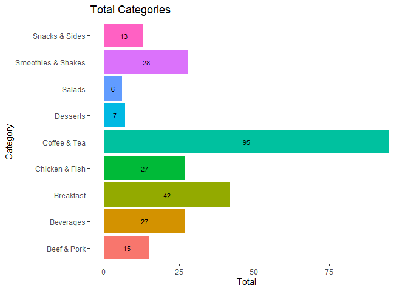
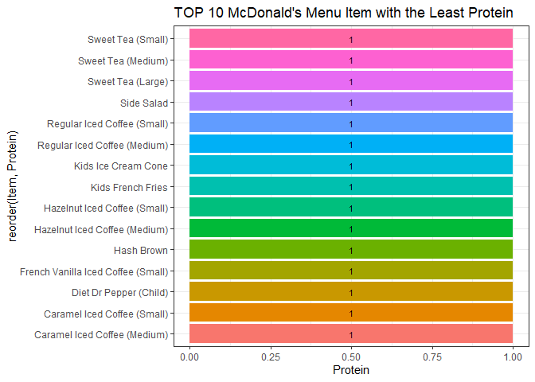
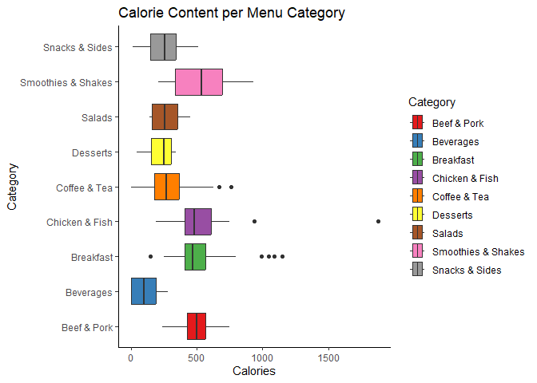
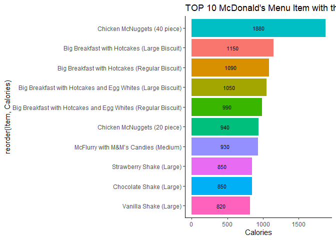
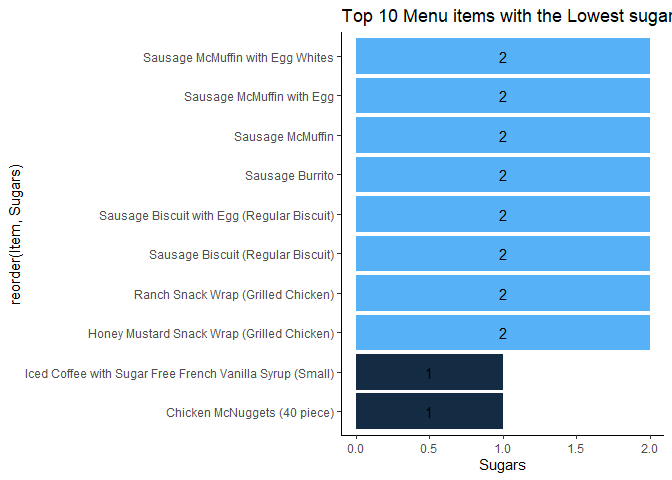
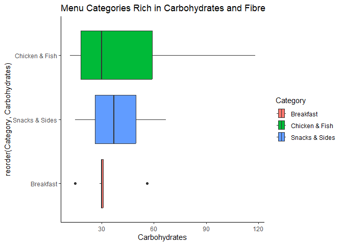
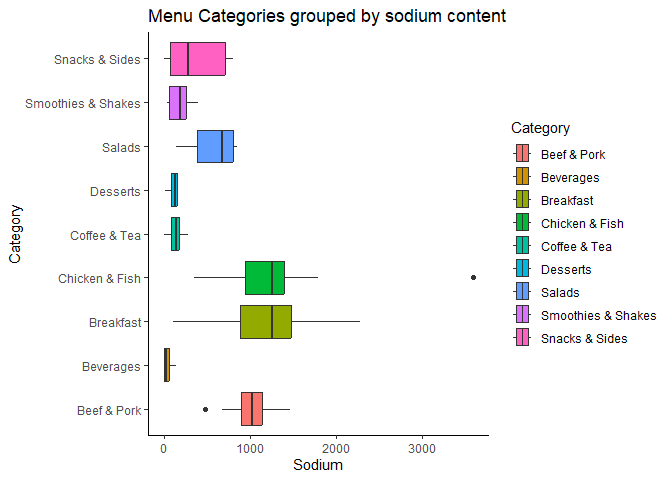
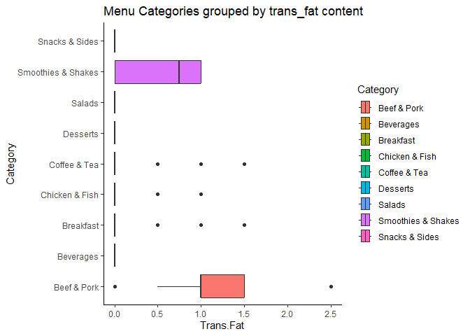

McDonald’s EDA
================

The EDA (Exploratory Data Analysis) on McDonald’s data revealed insights
into customers purchasing patterns, and menu preferences. It provides
valuable information for customers to make decisions on their dietary
wants and also valuable information for strategic decision-making and
targeted marketing efforts.

You can download the [dataset
here](https://www.kaggle.com/datasets/mcdonalds/nutrition-facts/data)

# Packages

***Load the Packages for data manipulation and visualization***

``` r
library(dplyr)
```

    ## 
    ## Attaching package: 'dplyr'

    ## The following objects are masked from 'package:stats':
    ## 
    ##     filter, lag

    ## The following objects are masked from 'package:base':
    ## 
    ##     intersect, setdiff, setequal, union

``` r
library(tidyverse)
```

    ## ── Attaching core tidyverse packages ──────────────────────── tidyverse 2.0.0 ──
    ## ✔ forcats   1.0.0     ✔ readr     2.1.5
    ## ✔ ggplot2   3.5.0     ✔ stringr   1.5.1
    ## ✔ lubridate 1.9.3     ✔ tibble    3.2.1
    ## ✔ purrr     1.0.2     ✔ tidyr     1.3.1

    ## ── Conflicts ────────────────────────────────────────── tidyverse_conflicts() ──
    ## ✖ dplyr::filter() masks stats::filter()
    ## ✖ dplyr::lag()    masks stats::lag()
    ## ℹ Use the conflicted package (<http://conflicted.r-lib.org/>) to force all conflicts to become errors

``` r
library(GGally)
```

    ## Registered S3 method overwritten by 'GGally':
    ##   method from   
    ##   +.gg   ggplot2

------------------------------------------------------------------------

*Read in the data*

------------------------------------------------------------------------

``` r
menu <- read.csv("menu.csv")
```

### Category

------------------------------------------------------------------------

The Menu Category is grouped according to the total number food items in
each Category.

------------------------------------------------------------------------

``` r
cat <- menu %>% 
  select(Category) %>% 
  count(Category,name = "Total")  %>% 
  distinct()

cat_plot <- cat %>% 
  ggplot(aes(Category,
             Total,
             fill = Category)) + 
  geom_col() + 
  theme_classic() + 
  labs(title = "Total Categories") + 
  theme(legend.position = "none") + 
  geom_text(aes(label = Total), 
            position = position_stack(vjust = 0.5),
            color ="black", size = 3) + coord_flip()


cat_plot
```

<!-- -->

``` r
#Coffee & Tea offers a lot a variation on the menu
```

# Protein

------------------------------------------------------------------------

Proteins are made up of chemical ‘building blocks’ called amino acids.
Your body uses amino acids to build and repair muscles and bones and to
make hormones and enzymes. They can also be used as an energy source.

------------------------------------------------------------------------

### The Average Protein Content in the Menu Category

``` r
Pro_avg <- menu %>% 
  select(Category,Item,Protein) %>% 
  group_by(Category) %>%
  aggregate(Protein~Category, 
            FUN = mean)

Pro_avg
```

<div data-pagedtable="false">

<script data-pagedtable-source type="application/json">
{"columns":[{"label":["Category"],"name":[1],"type":["chr"],"align":["left"]},{"label":["Protein"],"name":[2],"type":["dbl"],"align":["right"]}],"data":[{"1":"Beef & Pork","2":"27.333333"},{"1":"Beverages","2":"1.333333"},{"1":"Breakfast","2":"19.857143"},{"1":"Chicken & Fish","2":"29.111111"},{"1":"Coffee & Tea","2":"8.863158"},{"1":"Desserts","2":"4.000000"},{"1":"Salads","2":"19.833333"},{"1":"Smoothies & Shakes","2":"10.857143"},{"1":"Snacks & Sides","2":"8.384615"}],"options":{"columns":{"min":{},"max":[10]},"rows":{"min":[10],"max":[10]},"pages":{}}}
  </script>

</div>

``` r
#Chicken & Fish, Beef & pork contain higher protein content in every menu item
```

### The Menu item that contains the highest amount of Protein content

``` r
max_pro <- menu %>% 
  select(Item,Protein) %>%  
  group_by(Item) %>% 
  arrange(desc(Protein)) %>% 
  head(15) %>% 
  ggplot(aes(x= reorder(Item, 
                        Protein),
             fill = Item)) + 
  geom_bar(stat = "identity",
           aes(y= Protein )) +
  coord_flip() +
  theme_bw()+ 
  geom_text(aes(label = Protein, 
                y= Protein),
            position = position_stack(vjust = 0.5),
            color = "Black",
            size = 3)+
  theme(legend.position="none") +
  ggtitle("TOP 15 McDonald's Menu Item with the Highest Protein Content") +theme(panel.grid.major = element_blank(), panel.grid.minor = element_blank())

max_pro
```

<!-- -->

``` r
#Chicken McNuggents(40 pieces) tops the chart for meals with the highest protein content.
```

### What Menu item that contains the least amount of Protein content

``` r
min_pro <- menu %>% 
  select(Item,Protein) %>%  
  group_by(Item, Protein) %>% 
  filter(Protein >0 )%>% 
  arrange(Protein) %>% 
  head(15)  %>% 
  ggplot(aes(x= reorder(Item, 
                        Protein),
             fill = Item)) + 
  geom_bar(stat = "identity",
           aes(y= Protein )) +
  coord_flip() +
  theme_bw()+ 
  geom_text(aes(label = Protein, 
                y= Protein),
            position = position_stack(vjust = 0.5),
            color = "Black",
            size = 3)+
  ggtitle("TOP 10 McDonald's Menu Item with the Least Protein")+
  theme(legend.position="none")

min_pro
```

<!-- -->

``` r
#The protein levels in this category are very low.
```

# Calories

------------------------------------------------------------------------

A calorie is a measure of energy. Foods have calories. That is, foods
supply the body with energy, which is released when foods are broken
down during digestion. Energy enables cells to do all of their
functions, including building proteins and other substances needed by
the body. The energy can be used immediately or stored for use later.

------------------------------------------------------------------------

### How do the Menu category’s rank in order of Calories

``` r
cal <- menu %>% 
  select(Category,
         Item,
         Calories) %>% 
  group_by(Category)  


cal_plot <- cal %>% 
  ggplot(aes(Calories,
             Category,
             fill = Category)) + 
  geom_boxplot() + 
  theme_classic() + 
  scale_fill_brewer(palette = "Set1") + ggtitle("Calorie Content per Menu Category")

cal_plot
```

<!-- -->

``` r
#Smoothies & Shakes are going to give you the energy you need!!!
```

### The Top 10 Menu Food items with High calories Content

``` r
max_cal <- menu %>% 
  select(Category,
         Item,
         Calories) %>% 
  group_by(Item) %>% 
  arrange(desc(Calories))%>% 
  head(10)%>% 
  ggplot(aes(Calories,
             y = reorder(Item,
                         Calories)
             ,fill =Item)) + 
  geom_col() +
  theme_classic()+
  theme(legend.position = "none") + 
  geom_text(aes(label = Calories), 
            position = position_stack(vjust = 0.5),
            color="black", size =3) + ggtitle("TOP 10 McDonald's Menu Item with the Highest Calorie Content")

max_cal
```

<!-- -->

``` r
#Proteinous and Energy packed? Power to the McNuggets(40 pieces) !!!
```

### The Top 10 Menu Food items with Low calories Content

``` r
min_cal <- menu %>%
  select(Category,
         Item,
         Calories)%>% 
  filter(Calories>0) %>% 
  group_by(Item) %>% 
  arrange(Calories)%>% 
  head(10) %>% 
  ggplot(aes(Calories,
             y = reorder(Item,
                         Calories),
             fill =Item)) + 
  geom_col() + 
  theme_classic()+ 
  theme(legend.position = "none") + 
  geom_text(aes(label = Calories), 
            position = position_stack(vjust = 0.5),
            color="black", size =3) +
  scale_fill_brewer(palette = "Set3") + ggtitle("TOP 10 McDonald's Menu Item with Low Calorie Content")

min_cal
```

<!-- -->

``` r
#That's not a lot energy  but it's energy nonetheless.
```

# Carboydrates

------------------------------------------------------------------------

Carbohydrates, or carbs, are the sugars, starches, and dietary fiber
that occur in certain foods. The body breaks them down into glucose,
which provides energy.

------------------------------------------------------------------------

### The Menu Category with the Highest Carbohydrates Content

``` r
carb <- menu %>% 
  select(Category,
         Item,
         Carbohydrates)%>% 
  group_by(Category) 

carb_plot<- carb %>%
  ggplot(aes(Category,Carbohydrates, 
             fill = Category)) + 
  geom_boxplot() +
  scale_fill_brewer(palette = "Set1") + coord_flip() + theme_classic() + ggtitle("Menu Category with the Highest Carbohydrates Content")

carb_plot
```

<!-- -->

``` r
# Carbohydrates supply your body with glucose, which your cells use as fuel. Certain complex carbohydrates, like fiber, also feed your gut microbiome.
```

## Sugar

------------------------------------------------------------------------

Sugar also called simple carboydrates occur naturally in foods, such as
dairy products, as well as added sugar, which are common in baked goods,
sweets, and desserts. The body very easily digests and absorbs sugar.

------------------------------------------------------------------------

### The Top 10 Menu Food items with High Sugar Content

``` r
sugar <- menu %>%
  select(Category,Item,Sugars) %>% 
  group_by(Category)

max_sugar <-sugar %>% 
  arrange(desc(Sugars)) %>% 
  head(10) %>% 
  ggplot(aes(Sugars,
             y=reorder(Item,
                       Sugars),
             fill = Sugars)) +
  geom_col() + 
  theme_classic()+
  theme(legend.position = "none") +
  geom_text(aes(label = Sugars),
            position = position_stack(vjust = 0.5)) + ggtitle("Top 10 Menu items with the Highest Sugar Content")


max_sugar
```

<!-- -->

``` r
#Smoothies & Shakes come out the cream of crop in this category.
```

### The Top 10 Menu Food items with Low Sugar Content

``` r
min_sugar <- sugar %>% 
  filter(Sugars>0) %>% 
  arrange(Sugars) %>% 
  head(10) %>% 
  ggplot(aes(Sugars, 
             y=reorder(Item,
                       Sugars),
             fill = Sugars)) +
  geom_col() + 
  theme_classic()+
  theme(legend.position = "none") + 
  geom_text(aes(label = Sugars),
            position = position_stack(vjust = 0.5)) + ggtitle("Top 10 Menu items with the Lowest sugar Content")


min_sugar
```

<!-- -->

``` r
#Apparently chicken isn't sweet but tasty. Oh well better luck next time Mr. McNuggets!
```

### The Menu Categories with Carbohydrates that contain a higher Fibre to Sugar Ratio(Healthy Carbs)

------------------------------------------------------------------------

As a general rule, the more fiber and the less sugar there is in the
carbohydrate, the better it is for your body.

------------------------------------------------------------------------

``` r
healthy_carbs <-  menu %>% 
  select(Carbohydrates,
         Category,
         Sugars,
         Dietary.Fiber)  %>%  
  filter(Dietary.Fiber > Sugars)

healthy_carbs_plot <- healthy_carbs %>% 
  ggplot(aes(Carbohydrates,
             y = reorder(Category,Carbohydrates),
             fill = Category)) +
  geom_boxplot() + ggtitle("Menu Categories Rich in Carbohydrates and Fibre") + theme_classic()


healthy_carbs_plot
```

<!-- -->

### The Menu Categories grouped by sodium content

------------------------------------------------------------------------

Our bodies need sodium; however, there is so much in most processed
foods, and too much sodium can have several negative effects. Canned
foods are notorious for having lots of sodium, as are bottled sauces,
salty snacks, and processed foods. Most nutritionists recommend watching
your sodium intake carefully because too much sodium in your diet is
dangerous. It can lead to high blood pressure and many related health
conditions.

------------------------------------------------------------------------

``` r
sodium  <- menu %>%
  select(Category,
         Item,Sodium,
         Sodium....Daily.Value.) %>% 
  group_by(Category)


sodium_plot <- sodium %>% 
  ggplot(aes(Sodium,
             Category,
             fill = Category)) +
  geom_boxplot() + theme_classic() + ggtitle("Menu Categories grouped by sodium content")


sodium_plot
```

<!-- -->

### The Menu Categories grouped by Trans Fat

------------------------------------------------------------------------

In the United States, the main dietary source of trans fats is partially
hydrogenated vegetable oils, previously used in many commercially
prepared foods. Consuming trans fats may adversely affect cholesterol
levels in the body and may contribute to the risk of atherosclerosis.
Because of this, the US Food and Drug Administration (FDA) has banned
the use of trans fats in prepared foods.

``` r
trans_fat <- menu %>%
  select(Category,
         Trans.Fat) %>%
  group_by(Category)

trans_plot <- trans_fat %>% 
  ggplot(aes(Trans.Fat,
             Category,
             fill = Category)) + 
  geom_boxplot() + theme_classic() +  ggtitle("Menu Categories grouped by trans_fat content")

trans_plot
```

<!-- -->

### The Correlation between Protein,Carbohydrates, Fat and Calories

------------------------------------------------------------------------

Fats are the slowest source of energy but the most energy-efficient form
of food.Because fats are such an efficient form of energy, the body
stores any excess energy as fat.

``` r
calories <- menu %>%
  select(Calories,
         Carbohydrates, 
         Protein,
         Total.Fat) %>% 
  group_by(Calories)

calories_plot <- ggcorr(calories,
       method =  c("everything", "pearson"),
       label = TRUE)  + theme_classic() +  ggtitle("How Protein,Carbohydrates and Fat contribute to Calories?")

calories_plot
```

<!-- -->

in
